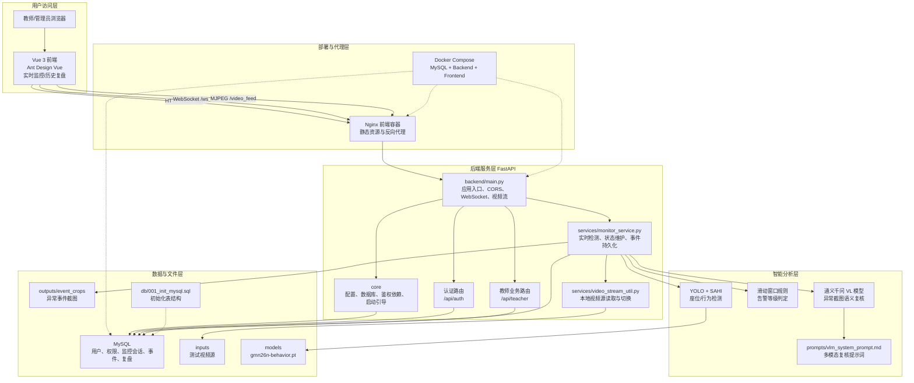
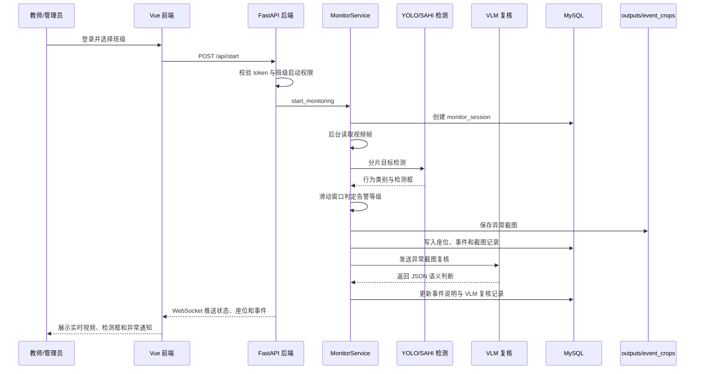

# 系统架构图

本文档图表采用 Mermaid 编写，可在 GitHub Markdown、支持 Mermaid 的编辑器或论文写作工具中渲染后导出为图片。

## 总体架构

```mermaid
flowchart TB
    subgraph client["用户访问层"]
        browser["教师/管理员浏览器"]
        ui["Vue 3 前端\nAnt Design Vue\n实时监控/历史复盘"]
        browser --> ui
    end

    subgraph deploy["部署与代理层"]
        nginx["Nginx 前端容器\n静态资源与反向代理"]
        compose["Docker Compose\nMySQL + Backend + Frontend"]
    end

    subgraph backend["后端服务层 FastAPI"]
        app["backend/main.py\n应用入口、CORS、WebSocket、视频流"]
        auth_router["认证路由\n/api/auth"]
        teacher_router["教师业务路由\n/api/teacher"]
        core["core\n配置、数据库、鉴权依赖、启动引导"]
        monitor_service["services/monitor_service.py\n实时检测、状态维护、事件持久化"]
        video_stream["services/video_stream_util.py\n本地视频源读取与切换"]
    end

    subgraph ai["智能分析层"]
        yolo["YOLO + SAHI\n座位/行为检测"]
        rules["滑动窗口规则\n告警等级判定"]
        vlm["通义千问 VL 模型\n异常截图语义复核"]
        prompt["prompts/vlm_system_prompt.md\n多模态复核提示词"]
    end

    subgraph data["数据与文件层"]
        mysql["MySQL\n用户、权限、监控会话、事件、复盘"]
        inputs["inputs\n测试视频源"]
        models["models\ngmn26n-behavior.pt"]
        outputs["outputs/event_crops\n异常事件截图"]
        schema["db/001_init_mysql.sql\n初始化表结构"]
    end

    ui -->|"HTTP REST /api"| nginx
    ui -->|"WebSocket /ws"| nginx
    ui -->|"MJPEG /video_feed"| nginx
    nginx --> app
    compose -.-> nginx
    compose -.-> app
    compose -.-> mysql

    app --> auth_router
    app --> teacher_router
    app --> core
    app --> monitor_service
    monitor_service --> video_stream
    monitor_service --> yolo
    monitor_service --> rules
    monitor_service --> vlm
    vlm --> prompt

    core --> mysql
    auth_router --> mysql
    teacher_router --> mysql
    monitor_service --> mysql
    video_stream --> inputs
    yolo --> models
    monitor_service --> outputs
    schema -.-> mysql
```
## 实时监控处理链路

```mermaid
sequenceDiagram
    participant U as 教师/管理员
    participant F as Vue 前端
    participant A as FastAPI 后端
    participant S as MonitorService
    participant D as YOLO/SAHI 检测
    participant V as VLM 复核
    participant DB as MySQL
    participant FS as outputs/event_crops

    U->>F: 登录并选择班级
    F->>A: POST /api/start
    A->>A: 校验 token 与班级启动权限
    A->>S: start_monitoring
    S->>DB: 创建 monitor_session
    S->>S: 后台读取视频帧
    S->>D: 分片目标检测
    D-->>S: 行为类别与检测框
    S->>S: 滑动窗口判定告警等级
    S->>FS: 保存异常截图
    S->>DB: 写入座位、事件和截图记录
    S->>V: 发送异常截图复核
    V-->>S: 返回 JSON 语义判断
    S->>DB: 更新事件说明与 VLM 复核记录
    A-->>F: WebSocket 推送状态、座位和事件
    F-->>U: 展示实时视频、检测框和异常通知
```
